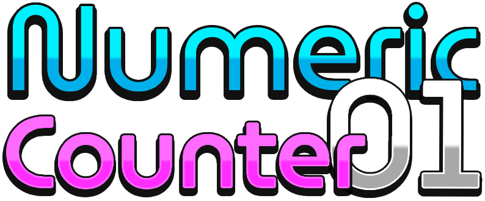
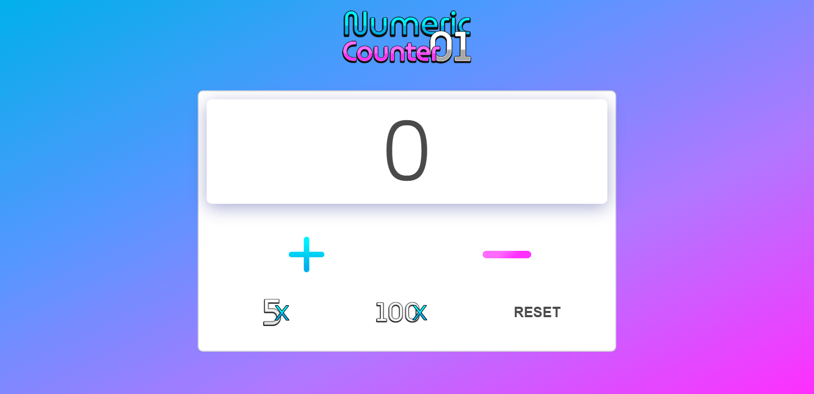
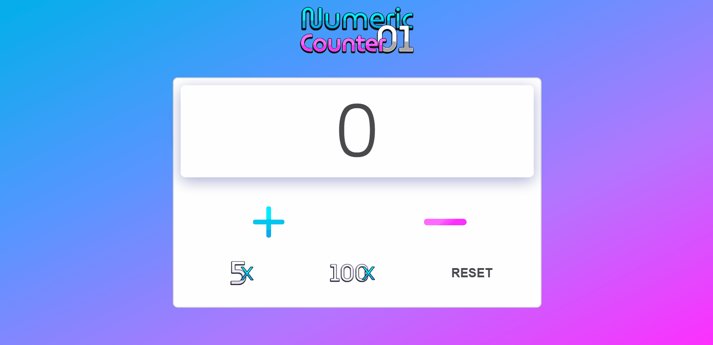
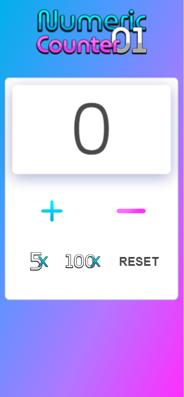

</img>
<h1>Project: Numeric Counter</h1>

Simple click counter, with the functionality to add and reduce a number, reset, add 5 numbers and 100 numbers at once.

Contador de cliques simples, com as funcionalidades de adicionar e reduzir um número, resetar, adicionar 5 números e 100 números de uma vez.

  
</img>
</img>

Versão Mobile

</img>

Technologies Used

   <h2>HTML CSS JS</h2>

Made by my👨🏻‍💻

<button><a href="https://helpful-flan-ef01e6.netlify.app">Access here</a></button>